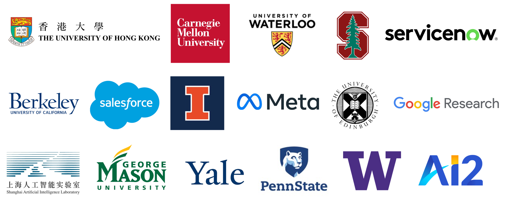

# UnifiedSKG:books:: Unifying and Multi-Tasking Structured Knowledge Grounding with Text-to-Text Language Models

<p align="left">
    <a href="https://img.shields.io/badge/PRs-Welcome-red">
        
    </a>
    <a href="https://img.shields.io/github/last-commit/HKUNLP/UnifiedSKG?color=green">
        
    </a>
    <a href="https://colab.research.google.com/drive/1f9yTXC3GpSyRJOjzsKceG_bhk-Cw71Ga#scrollTo=r_3-DN0SvC97">
        
    </a>
    <br/>
</p>

Code for paper [UnifiedSKG: Unifying and Multi-Tasking Structured Knowledge Grounding with Text-to-Text Language Models](https://arxiv.org/pdf/2201.05966.pdf). Please refer to our [project page](https://unifiedskg.com/) for up-to-date related resources (e.g., papers, code, tools, tutorials) for Structured Knowledge Grounding. Load our checkpoints from [HuggingFace Model Hub](https://huggingface.co/hkunlp).


**S**tructured **k**nowledge **g**rounding (**SKG**) leverages structured knowledge to complete user requests, such as semantic parsing over databases and question answering over knowledge bases. Since the inputs and outputs of SKG tasks are heterogeneous, they were historically studied in separate by different communities,  which limits systematic and compatible research on SKG. In this paper, we overcome this limitation by proposing the **UnifiedSKG framework**, which unifies **21 SKG tasks** into the text-to-text format, aiming to promote systematic SKG research, instead of being exclusive to a single task, domain, or dataset. We show that large language models like T5, with simple modification when necessary, achieve **state-of-the-art performance on nearly all 21 tasks**. UnifiedSKG facilitates **multi-task learning**. We show that multi-task prefix-tuning benefits most tasks, largely improving the overall performance. UnifiedSKG is a challenging testbed for **zero-shot and few-shot learning**, which T0, GPT-3, and Codex struggle in. UnifiedSKG also enables a series of controlled experiments on **structured knowledge encoding** variants across SKG tasks. We find that T5’s sensitivity to structured knowledge encoding variations varies across tasks. 

We have expanded on the basis of UnifiedSKG, added **Chinese tokenizer** and made UnifiedSKS support the **Chinese pretraining model** (such as the [T5-Pegasus-base](https://huggingface.co/imxly/t5-pegasus) or [T5-Pegasus-small](https://huggingface.co/imxly/t5-pegasus-small) of Zhuiyi Technology)
## Updates
- **2022-10-7**: Add `tokenizer_chn.py` and `trainer_chn` on the original framework to support Chinese generation task.

## Content

- [UnifiedSKG:books:: Unifying and Multi-Tasking Structured Knowledge Grounding with Text-to-Text Language Models](#unifiedskgbooks-unifying-and-multi-tasking-structured-knowledge-grounding-with-text-to-text-language-models)
  - [Updates](#updates)
  - [Content](#content)
  - [Cloning this repo](#cloning-this-repo)
  - [Dependencies](#dependencies)
- [The following line to be replaced depending on your cuda version.](#the-following-line-to-be-replaced-depending-on-your-cuda-version)
  - [Usage](#usage)
    - [Environment setup](#environment-setup)
    - [WandB setup](#wandb-setup)
    - [Update transfermer library file](#update-transfermer-library-file)
    - [Training](#training)
    - [Load weights](#load-weights)
  - [Code structure overview of UnifiedSKG](#code-structure-overview-of-unifiedskg)
  - [Add a new task into UnifiedSKG](#add-a-new-task-into-unifiedskg)
  - [Misc](#misc)
  - [Citation](#citation)
  - [Contributors](#contributors)


## Cloning this repo

In order to include third-party dependencies in this repository, make sure to clone recursively, e.g.:

```
git clone --recurse-submodules https://github.com/GengRuotong/UnifiedSKG.git
```

## Dependencies

To establish the environment run this code in the shell (the third line is for CUDA11.1):

``````
conda env create -f py3.7pytorch1.8.yaml
conda activate py3.7pytorch1.8new
pip install datasets==1.14.0
# The following line to be replaced depending on your cuda version.
pip install torch==1.8.0+cu111 torchvision==0.9.0+cu111 torchaudio==0.8.0 -f https://download.pytorch.org/whl/torch_stable.html
``````

That will create the environment `py3.7pytorch1.8new` we used. 

## Usage

### Environment setup
Activate the environment by running
``````shell
conda activate py3.7pytorch1.8new
``````

### WandB setup

Setup [WandB](https://wandb.ai/) for logging (registration needed):
``````shell
export WANDB_API_KEY=YOUR_WANDB_API_KEY
export WANDB_PROJECT=YOUR_PROJECT_NAME
export WANDB_ENTITY=YOUR_TEAM_NAME
``````

### Update transfermer library file

The transfermer version required by the original UnifiedSKG will report an error `'TypeError: unsupport operand type(s) for +: 'Tensor'and 'list' `when processing Chinese input data. We compared the old and new versions of the transformer and found that the new version of the transformer has added a list of type processing logic, so you need to change the `__call__` function in `/path to your envs/py3.7pytorch1.8new/lib/python3.7/site-packages/transformers/data/data_collator.py` as follows:

``````python
    for feature in features:
        remainder = [self.label_pad_token_id] * (max_label_length - len(feature["labels"]))
        if isinstance(feature["labels"], list):
            feature["labels"] = (
                feature["labels"] + remainder if padding_side == "right" else remainder + feature["labels"]
            )
        elif padding_side == "right":
            feature["labels"] = np.concatenate([feature["labels"], remainder]).astype(np.int64)
        else:
            feature["labels"] = np.concatenate([remainder, feature["labels"]]).astype(np.int64)
``````

### Training

T5-base prefix-tuning on mt_maoyanyanchu (1 GPU)
``````shell
CUDA_VISIBLE_DEVICES=1 python train.py \
    --run_name T5_base_prefix_summary \
    --seed 2 \
    --cfg Salesforce/T5_base_prefix_summary.cfg \
    --do_train \
    --do_eval \
    --do_predict \
    --domain_name mt_maoyanyanchu \
    --predict_with_generate \
    --num_train_epochs 8 \
    --gradient_accumulation_steps 4 \
    --logging_strategy steps \
    --logging_first_step true \
    --logging_steps 100 \
    --evaluation_strategy steps \
    --eval_steps 500 \
    --metric_for_best_model avr \
    --greater_is_better true \
    --save_strategy steps \
    --save_steps 1000 \
    --save_total_limit 1 \
    --load_best_model_at_end \
    --adafactor true \
    --learning_rate 1e-4 \
    --predict_with_generate \
    --output_dir output/T5_base_prefix_summary/maoyanyanchu \
    --overwrite_output_dir \
    --per_device_train_batch_size 2 \
    --per_device_eval_batch_size 8 \
    --generation_num_beams 1 \
    --generation_max_length 128 \
    --input_max_length 512 \
    --num_beams=1 
``````
If you want to resume training, remove the ``--overwrite_output_dir`` flag from the above command.

For MT summary task, we have integrated the above instructions into the `train.sh` file, so you only needs to run the following instructions to perform training, verification and testing.
``````shell
sh train.sh
``````

### Load weights
See <a href="https://colab.research.google.com/drive/1f9yTXC3GpSyRJOjzsKceG_bhk-Cw71Ga#scrollTo=r_3-DN0SvC97">
        
    </a>

## Code structure overview of UnifiedSKG
    .
    ├── configure                              # Config files for experiments, tasks, and settings
    │   ├── META_TUNING                        # Config files for tasks and settings
    │   └── Salesforce                         # Config files for experiments (see Misc)
    │
    ├── data(Optional)                         # Folder to place local data
    ├── pretrained_model(Optional)             # Folder to place pretrained models(e.g. chinese_t5_pegasus_base)
    ├── metrics                                # Code for evaluation
    │   └── ...                                # Please check the README of the ./seq2seq_construction.
    ├── models                                 # Code for models
    │   ├── adapter                            # Code for T5 and BART with adapters (based on HuggingFace Transformers)
    │   ├── prompt                             # Code for T5 and BART with prefix-tuning (based on HuggingFace Transformers)
    │   └── unified
    │           ├── base.py                    # Code for the base model that enables an arbitrary model to be pushed to HuggingFace Model Hub (namely, PushToHubFriendlyModel)
    │           ├── finetune.py                # Code for finetuning
    │           ├── adaptertuning.py           # Code for adapter-tuning
    │           ├── prefixtuning.py            # Code for prefix-tuning
    |           ├── tokenizer_chn.py           # T5PegasusTokenizer for Chinese
    │           └── combined_prefixtuning.py   # Code for combined prefix-tuning (not used in our paper, see Misc)
    │
    ├── seq2seq_construction                   # Code for converting raw data into sequences
    │    └──  ...                              # Please check the README in this directory.
    │
    ├── tasks                                  # Code for loading raw data, If using local data, change the load path to the path of the local data.
    │    └──  ...                              # Please check the README in this directory.
    │
    ├── third_party                            # Packages from third parties
    │    └──  ...                              # Please check the README in this directory.
    │
    ├── utils                                  # Code for some (probably) useful stuff
    │       ├── processor                      # Adopted from Tapex: the processor that handles table truncation and linearization
            │        └──  ...            
    │       ├── configure.py                   # Code for parsing config files in ./configure
    │       ├── dataset.py                     # Code for converting input and output sequences into Datasets for training
    │       ├── tool.py                        # Code for loading models, seq2seq constructors, and evaluators
    │       ├── trainer.py                     # Code for EvaluationFriendlyTrainer. If you want make training-specific modifications, you may want to change something here.
    │       ├── training_arguments.py          # Code for seq2seq training arguments
    |       ├── trainer_chn.py                 # Code for Seq2SeqTrainer_Chinese
    │
    ├── .gitignore                 
    ├── .gitmodules                    
    ├── py3.7pytorch1.8.yaml                   # Anaconda environment config file
    ├── README.md                              # The README file you are looking at :)
    └── train.py                               # Entry code, which controls train, eval, test, storage, and logging


## Add a new task into UnifiedSKG

(READMEs in `./tasks`, `./seq2seq_construction`, `./metrics`, `./configure` can also be helpful)

1. Add a "Loader" of raw data under `./tasks`. If you use local data, you need to change the load path of the corresponding data load file under `./tasks` to the path of the local data. You can search [HuggingFace Datasets](https://github.com/huggingface/datasets) for possibly useful scripts. If not, you can be the contributor of both this project and the HuggingFace community.
2. Add a "Sequence Wrapper" under `./seq2seq_construction` to construct sequence inputs (user request and structured knowledge) and sequene outputs from raw data for the unification.
3. Add an "Evaluator" for your task under `./metrics`. If a third-party repository is used, remember to add it into [.gitmodules](https://git-scm.com/docs/gitmodules). 
4. *(optional)* You can add a new "Model" under `./models` for a new model architecture or a new learning algorithm.
5. Add a config file for your task under `./configure/META_TUNING`.
6. Add a config file for each of your experiment under `./configure/Salesforce`. If the local pretraining model is used, you need to change `bert.location` parameter in the corresponding task configuration file to the storage path of the pretraining model.

## Misc
- We name the diretory for experimental config files as Salesforce because we would like to thank Salesforce Research for providing a large number of GPUs. We would also like to thank Amazon Research Awards, ServiceNow Research, and Yale NLP for providing computing resources generously. 
- `./models/unified/combined_prefixtuning.py` is not used in our paper. This file contains code for the *interaction* between multiple prefixes in a single training loop. We tried some variants of such interaction but did not find any of them to outperform the (extremely simple) transfer learning-based approach used in our paper. However, we open-source our failed attempts and call for potential future exploration. 



**That's all for it :D**

## Citation
If you find our work helpful, please cite as
```
@article{UnifiedSKG,
      title={UnifiedSKG: Unifying and Multi-Tasking Structured Knowledge Grounding with Text-to-Text Language Models}, 
      author={Tianbao Xie and Chen Henry Wu and Peng Shi and Ruiqi Zhong and Torsten Scholak and Michihiro Yasunaga and Chien-Sheng Wu and Ming Zhong and Pengcheng Yin and Sida I. Wang and Victor Zhong and Bailin Wang and Chengzu Li and Connor Boyle and Ansong Ni and Ziyu Yao and Dragomir Radev and Caiming Xiong and Lingpeng Kong and Rui Zhang and Noah A. Smith and Luke Zettlemoyer and Tao Yu},
      journal={arXiv preprint arXiv:2201.05966},
      year={2022},
}
```

## Contributors
<a href="https://github.com/Timothyxxx">  </a> 
<a href="https://github.com/ChenWu98"></a> 
<a href="https://github.com/Impavidity">  </a> 
<a href="https://github.com/michiyasunaga"></a>
<a href="https://github.com/cascadianblue"></a>
<a href="https://github.com/chengzu-li"></a>
<a href="https://github.com/jasonwu0731"></a>
<a href="https://github.com/HKUNLP/UnifiedSKG/pulls"></a>


